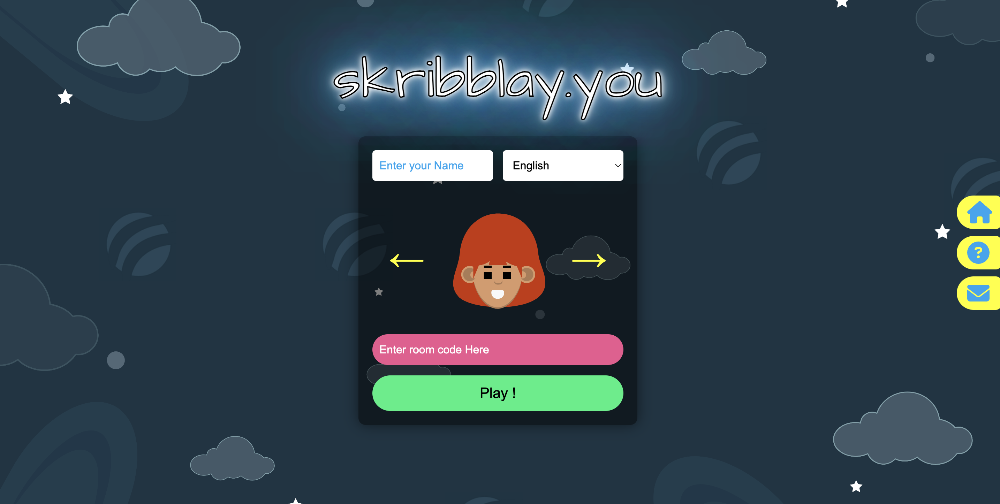
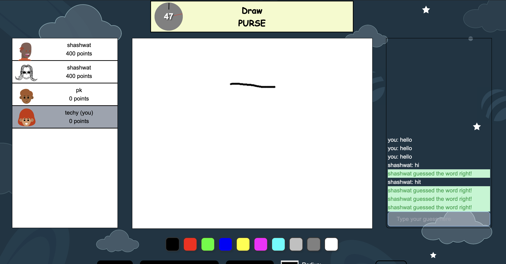
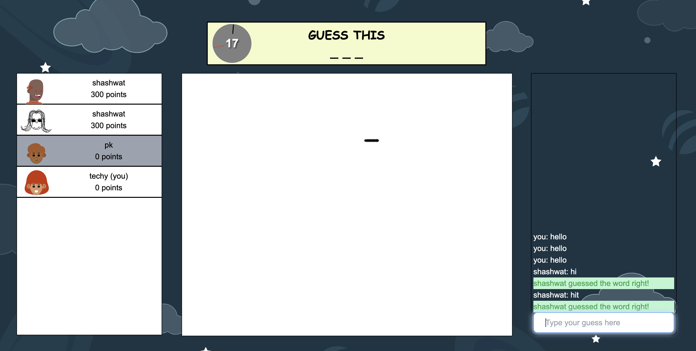

# Skribblay.you - A Clone of Skribbl.io

Welcome to **Skribblay**, a fun and engaging online multiplayer drawing and guessing game inspired by Skribbl.io. This project aims to replicate the core functionalities of the original game, providing an entertaining platform where players can showcase their drawing skills and guess the drawings of others.

## Table of Contents

- [Features](#features)
- [Screenshots](#screenshots)
- [Installation](#installation)
- [Usage](#usage)
- [Contributing](#contributing)
- [License](#license)
- [Contact](#contact)

## Features

- Multiplayer drawing and guessing game
- Real-time gameplay with smooth and responsive interactions
- Customizable game rooms with different word packs
- In-game chat functionality
- User-friendly and intuitive interface
- Leaderboard to track player scores

## Screenshots


*Game Lobby*


*Drawing Interface*


*Guessing Phase*

## Installation

To get a local copy up and running, follow these steps:

1. **Clone the repository:**

    ```sh
    git clone https://github.com/techysanoj/skribble-clone.git
    cd skribble-clone
    ```

2. **Install dependencies:**

    ```sh
    npm install
    ```

3. **Start the development server:**

    ```sh
    npm start
    ```

4. **Open your browser and navigate to:**

    ```
    http://localhost:3000
    ```

## Usage

1. **Create or join a game room:**
    - To start a new game, click on "Create Room" and share the room code with friends.
    - To join an existing game, enter the room code provided by the host.

2. **Gameplay:**
    - One player will be chosen to draw a word.
    - Other players will guess the word based on the drawing.
    - Points are awarded for correct guesses and drawing accuracy.

3. **Chat:**
    - Use the in-game chat to communicate with other players during the game.

## Contributing

We welcome contributions from the community! To contribute, please follow these steps:

1. **Fork the repository.**

2. **Create a new branch:**

    ```sh
    git checkout -b feature/your-feature-name
    ```

3. **Make your changes and commit them:**

    ```sh
    git commit -m 'Add some feature'
    ```

4. **Push to the branch:**

    ```sh
    git push origin feature/your-feature-name
    ```

5. **Create a pull request.**

Please ensure your code adheres to our coding standards and includes relevant tests.

## License

This project is licensed under the MIT License. See the [LICENSE](LICENSE) file for details.

## Contact

If you have any questions or suggestions, feel free to reach out to the project maintainers:

- **Your Name** - [panditsanoj124@gmail.com](mailto:panditsanoj124@gmail.com)
- GitHub: [techysanoj](https://github.com/techysanoj)
- Shashwat Bindal - shashwat.bindal2002@gmail.com
- GitHub: [shashwat282002](https://github.com/shashwat282002)
- Priyanshu Bhardwaj - priyanshubhardwaj70@gmail.com
- GitHub: [PriyanshuA1507](https://github.com/PriyanshuA1507)
---

Thank you for visiting **Skribblay.you**! We hope you enjoy playing and contributing to the project.
